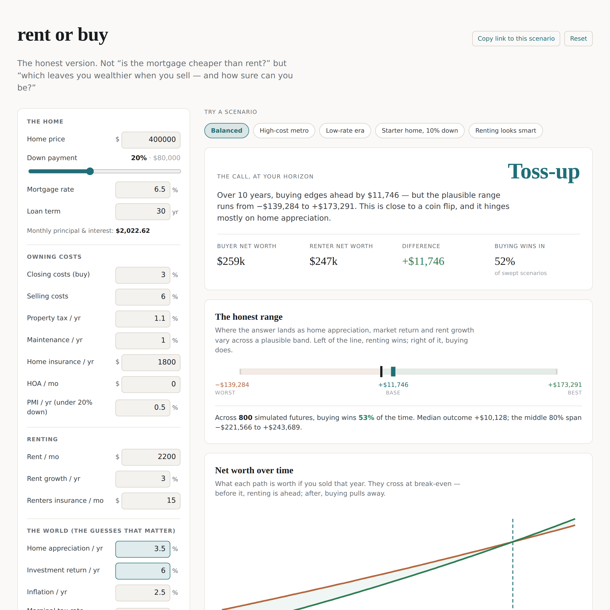

# rent-or-buy

An honest rent-vs-buy calculator. It answers the question the popular ones
dodge: **not** "is my mortgage payment less than rent?" but "which choice
leaves me wealthier by the time I'd sell — and how much does that answer
depend on things nobody can actually know?"

The headline finding this tool exists to make unavoidable: for a typical
scenario the decision is often a **coin flip that hinges almost entirely on
home appreciation**, an assumption every calculator quietly hard-codes and
nobody can forecast. So this one refuses to hand you a single number. It
hands you a range, a break-even year, and a ranking of which assumption your
answer is hostage to.

**Live calculator:** https://finntech3.github.io/rent-or-buy/



```
$ npm run analyze 10

  RENT-OR-BUY — $400,000 home, 10-year horizon

Break-even (buying pulls ahead)  8.3 yr (month 99)
Difference (buy − rent)          +$11,746

  VERDICT: TOSS-UP
  Honest range (worst … best)    -$139,284 … $173,291
  Buying wins in                 52% of the swept scenarios

  What the answer hinges on (biggest swing first):
    homeAppreciationPct          1.5% → 5.5%  swings $180,827
    investmentReturnPct          4% → 8%      swings  $81,504
    rentGrowthPct                1.5% → 4.5%  swings  $50,216
```

That $12k "buying wins" headline is real — and meaningless on its own, next
to a band from −$139k to +$173k driven by an appreciation rate you're
guessing at. Showing that is the entire point.

## What's here

- `src/lib/money.ts` — money as integer cents, never floats.
- `src/lib/mortgage.ts` — fixed-rate amortization, verified against textbook
  figures and self-checked to pay the loan off to the exact cent.
- `src/lib/model.ts` — the net-worth projection: both paths on identical
  cash-flow footing, month by month, with each month's point already
  carrying the net worth of selling then (so break-even falls out of one
  pass).
- `src/lib/sensitivity.ts` — the range and the tornado: sweep the three
  drivers that matter, report the outcome band and which assumption swings
  it most.
- `src/cli/analyze.ts` — the headless report above. `npm run analyze [years]`.
- 45 tests, including the economics moving the right way in every direction.

## Running

```
npm install
npm test              # 45 tests, all green
npm run analyze 10    # the report, for a 10-year horizon
```

## The method

Both a buyer and a renter start with the same resources and are held to the
same monthly budget, so the comparison is apples to apples:

- The **renter** invests, from day one, the exact cash the buyer sinks and
  can't get back — the down payment plus the buyer's closing costs — and it
  compounds at the market return.
- Each month, whichever party spends **less** on housing invests the
  surplus at that same return. Early on that's usually the renter; once rent
  climbs past the (mostly fixed) cost of owning, it flips to the buyer.
- At any month the buyer could sell: their **home equity** — sale price
  minus selling costs minus the remaining loan — is netted against their
  side investments and compared to the renter's portfolio.

The buyer's edge is forced saving and leverage on appreciation; the renter's
edge is a large liquid sum invested from day one and no transaction costs.
Which wins is genuinely uncertain, which is why the output is a range.

**Conventions that change the answer, stated plainly.** Home value and the
investment portfolios compound monthly. Rent, property tax, maintenance,
insurance and HOA step once a year, the way real leases and assessments do.
Property tax and maintenance track the *current* home value; insurance and
HOA track general inflation. Everything is integer cents, so interest and
growth accumulated over hundreds of months are exact rather than nearly so —
the same discipline as [orderbook-live](https://github.com/finntech3/orderbook-live)'s
integer tick grid, ported for the same reason.

## What it deliberately does not pretend to know

An honest tool is honest about its edges. This model, in its current form:

- **Models the tax deduction simply, and off by default.** The optional
  marginal-rate deduction on mortgage interest + property tax ignores the
  SALT cap and the standard-deduction crossover — the two things that make
  the real benefit far smaller than calculators claim — so it defaults to
  zero rather than overstate buying.
- **Assumes a fixed rate and no refinancing.** No ARMs, no rate path, no
  refi. A fixed 30-year is the honest default; the rest is a forecast on top
  of a forecast.
- **Is deterministic, not Monte Carlo.** The range comes from sweeping
  assumptions across a plausible band, not from simulating return
  volatility. That understates tail risk on the invested side and is the
  most likely next addition.
- **Grows property tax with market value.** Places with assessment caps
  (California's Prop 13, say) would tax more slowly than this assumes.

Each of these is a place the answer could move, and naming them is the point
rather than burying them.

## The calculator

`npm run dev` runs the interface locally; it's one editorial screen — a
scenario panel on the left, and on the right the verdict, the **honest range
bar**, a **net-worth chart** where the buyer and renter curves cross at
break-even, and a **tornado** ranking which assumption the answer is hostage
to. Every input recomputes everything live (a full sensitivity sweep is 27
cheap projections). The whole scenario lives in the URL, so any result is a
shareable link — tweak the inputs, copy the link, send someone your exact
case. Light by default, dark via `prefers-color-scheme`, no external fonts or
network calls — the engine runs entirely in the browser, so it deploys as
static files with no backend.

`src/app/App.tsx` is presentation only; it holds no financial logic, calling
the engine surface:

```ts
import { project, terminal } from "./lib/model";
import { analyse, verdict } from "./lib/sensitivity";

const proj = project(inputs, horizonMonths);   // per-month net-worth series
const end  = terminal(proj);                     // difference at the horizon
const sens = analyse(inputs, horizonMonths);     // range + tornado
verdict(sens);                                   // "buy" | "rent" | "toss-up"
```

## Tech

TypeScript (strict, `noUncheckedIndexedAccess`, `exactOptionalPropertyTypes`)
· Vitest · zero runtime dependencies.
